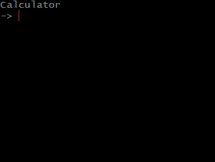

# Go-Calculator
A simple command line calculator in Go. Implemented to practice Pratt Parsing from the Crafting Interpreters book, heavily inspired by [this article](https://dev.to/jrop/pratt-parsing). 
Correctly handles precedence, parentheses, and the power operator in a right associative way.

Still lots of things not supported, such as overflow.
